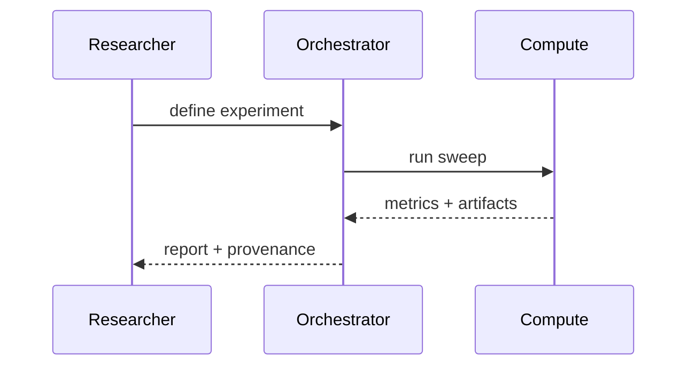

# Automation Bottleneck

Many AI-for-science workflows bottleneck on automation, not model capability: data movement, provenance, experiment orchestration, and reliable evaluation.

## A simple checklist

- Inputs are versioned (data + prompts + code)
- Runs are reproducible (configs + seeds + environments)
- Results are queryable (metadata + artifacts)
- Failures are observable (logs + traces)

