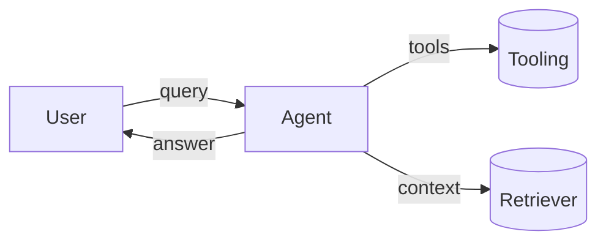

# BB84

Notes on LLMs, agent architectures, and AI-for-science: practical, skeptical, and systems-first.

## What you’ll find here

- Concise technical essays and design notes
- Reproducible examples with runnable code
- Diagrams (including Mermaid) to clarify architectures

### Example: code block

```python
def best_practice(prompt: str) -> dict:
    return {"prompt": prompt, "keep_it": "simple", "measure": True}
```

### Example: Mermaid diagram



